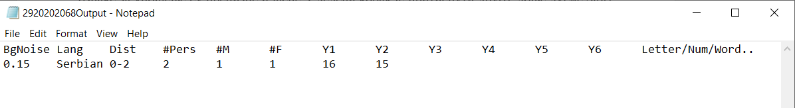

# Application of deep learning algorithms in user recognition based on motion sensors.

## Summary
  Goal of the thesis is to find out if it possible to find some attributes of speakers who are speaking near smartphone in idle state (on nearby horizontal surface) based on values from accelerometer and gyroscope. Accelerometer and gyroscope are very sensitive sensors which means they will catch some vibrations even though phone is not moving. We will then input sensor values into deep learning algorithm to learn based on output we manually created for each test. 

  We will try to predict 
  * background noise (low, medium, high)
  * language (Serbian, English, German)
  * distance from phone (0-2, 3-5, 5+ meters)
  * number of people speaking (1, 2, 3, 4, 5, 6+)
  * at least 1 male
  * at least 1 female
  * speakers years (<18, 18-30, >30)
  * certain letters or words ('a', 'knjiga', 'letter', 'schmetterling')

## Collecting data
  The first part of the thesis was data collection, which will be later entered into the algorithm. One test represents 60 seconds of recording data from the accelerometer and gyroscope in unique situations at a frequency of 200Hz. One situation is a combination of characteristics such as number, gender, location, age and language of the speaker. 315 tests were performed for a certain period of time. Collecting is done with small Unity application which will generate input (sensor values) and output (speaker attributes).
  Unity project can be found in */Gyroscope data/* folder.
  

*Gyroscope data Unity application*
  

*Generated input*  

*Generated output*

## Data processing
The second part is data processing to prepare them for insertion into the algorithm. All input text files need to have same amount of lines and same formating for input files to be ready for creating dataset. Second thing is to create three datasets from original 200Hz dataset. This will be done by taking out every second or forth line to get dataset with 50Hz and 100Hz. Third thing is creating vector from x, y and z coordinates, so we can test if vector perform better in future tests. After this phase we will have total of six datasets. 
All python scripts for formating can be found in */Deep Learning/Python scripts/Formating input data/* folder.

## Applying deep learning algorithms
The third part of the paper is iterating different data sets through different hyperparameters of many different deep neural network models and recording accuracy statistics. Results are recorded every tenth iteration as arithmetic mean for better precision. Python script can be found in */Deep Learning/Python scripts/Deep Learning scripts/test.py*

## Results

Goal | Number of categories | Random selection [%] | Best accuracy achieved [%] | Average accuracy achieved [%]
------------- | ------------- | ------------ | ------------- | ------------
Content from cell 1 | Content from cell 2 | Content from cell 1 | Content from cell 2 | Content from cell 1
Content in the first column | Content in the second column | Content in the first column | Content in the second column | Content in the first column
Content in the first column | Content in the second column | Content in the first column | Content in the second column | Content in the first column
Content in the first column | Content in the second column | Content in the first column | Content in the second column | Content in the first column

